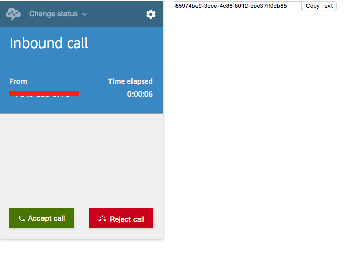

# AmazonConnectChromeExtension
A Google Chrome extension that displays the Contact ID attribute of an incoming call in Amazon Connect.

This extension is a working example of accessing global variables via a Google Chrome extension. This is actually more challenging than it should be (as detailed [here](https://stackoverflow.com/questions/9602022/chrome-extension-retrieving-global-variable-from-webpage)). 

As an incoming call is received the extension will automatically populdate the Contact ID attribute in a text box for easy copy/paste access.

Installing a Chrome extension is very simple and explained [here](https://developer.chrome.com/extensions/getstarted). 
